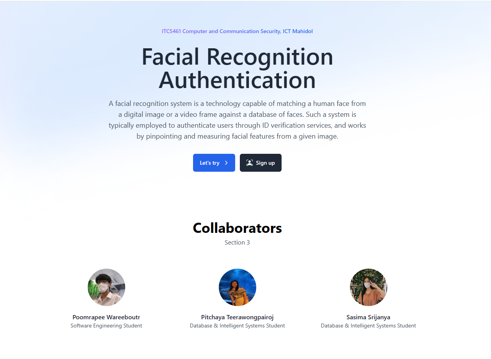
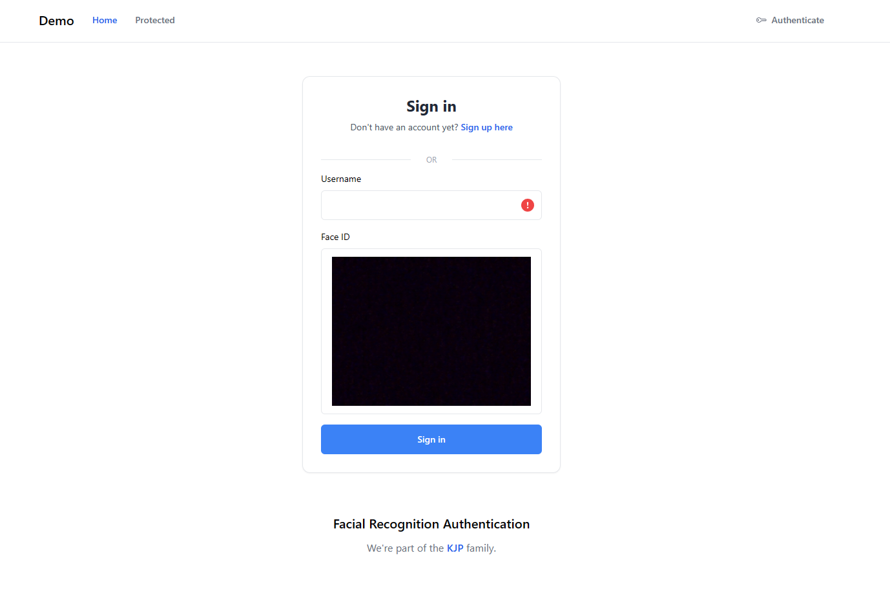
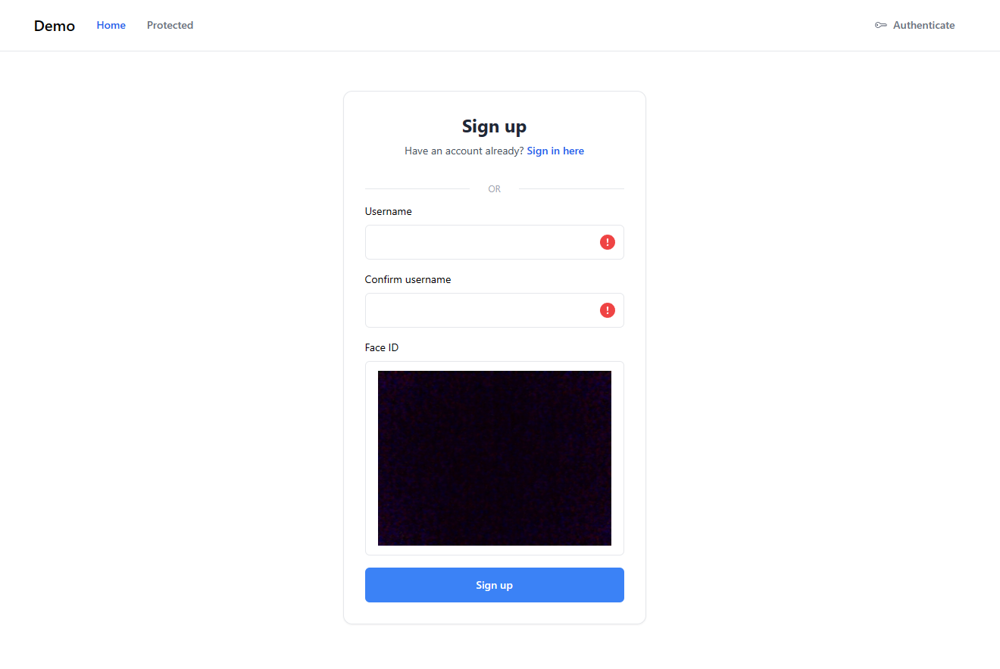
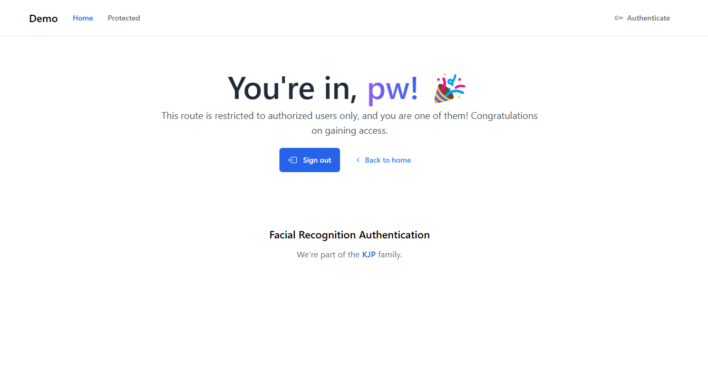

# Facial Authentication App

## About this project

This project revolves around a small web-based application that utilizes Vue.js in conjunction with the Python [face_recognition](https://github.com/ageitgey/face_recognition) module to facilitate facial authentication.

## Run the demo

1. Install [Docker Desktop](https://www.docker.com/products/docker-desktop/).
2. Clone this repository.
3. Change the directory to `cd .\facial-recognition-app\`.
4. Run the application by `docker compose up -d` command in your terminal.
5. The Application will be running at http://localhost:3000/.
6. Terminate the application using `docker compose down --rmi local` command.

*Note: Make sure your Docker Desktop is running.*

## Snapshots 

## Collaborators
- Poomrapee Wareeboutr ([GitHub](https://github.com/PoomrapeeWareeboutr))
- Pitchaya Teerawongpairoj ([GitHub](https://github.com/Koikwang))
- Sasima Srijanya ([GitHub](https://github.com/Jenny-Sasima))
